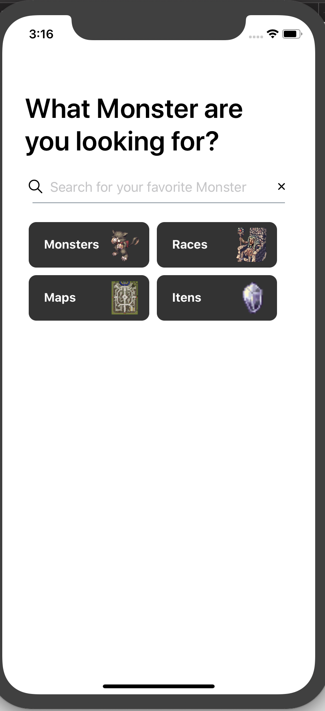
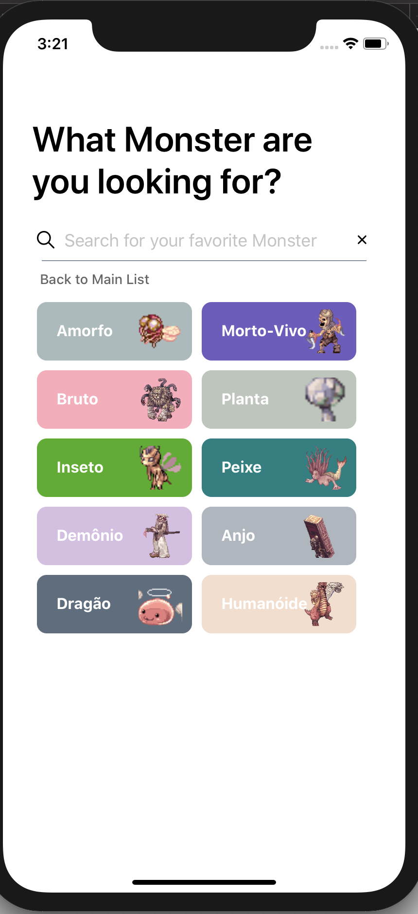
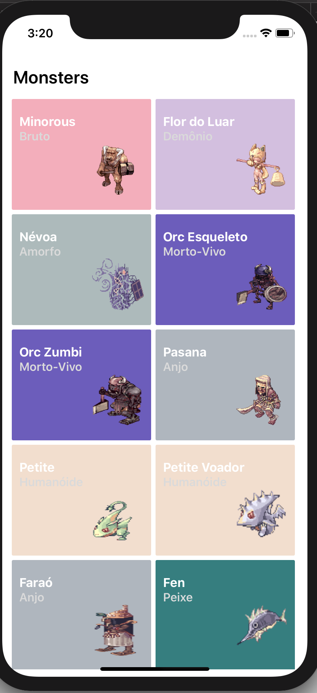
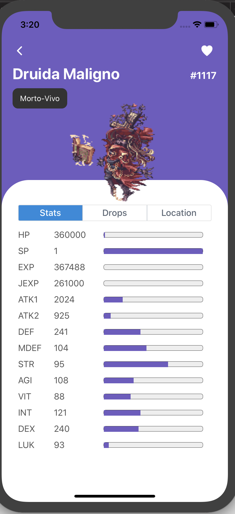
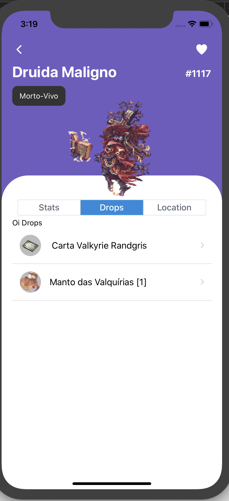
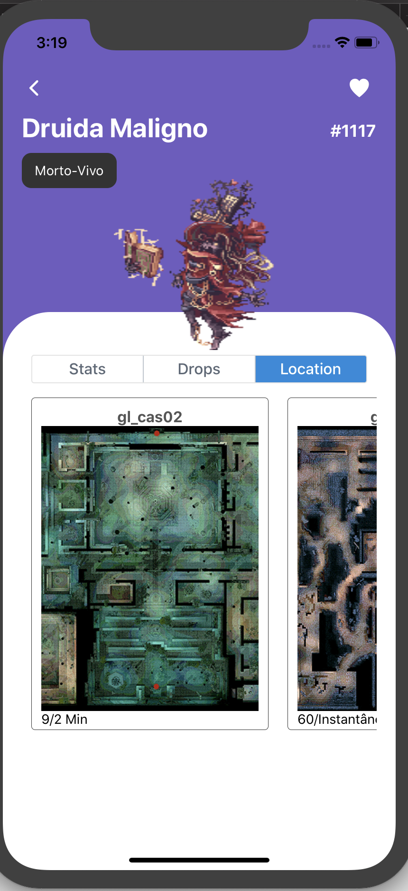
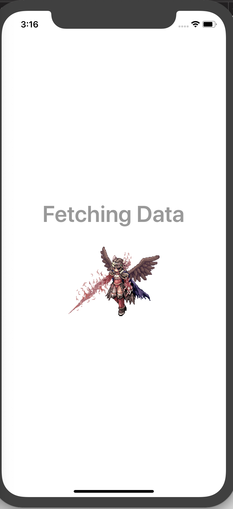

# Ragnarok Database

  
  

Ragnarok app built with React Native

## Download

Go to the [releases page](https://github.com/scitbiz/flutter_pokedex/releases) to download the latest available apk.

## App preview

## Installation

- Add [React Native](https://facebook.github.io/react-native/docs/getting-started) on your machine

- Install the packages `npm install`

## Todos

- [x] Home
- [x] Monster List
- [ ] Monster List - Per Race
- [x] Monster Info - Status
- [ ] Monster Info - Drops
- [x] Monster Info - Location
- [ ] Maps
- [ ] Monster by Map
- [ ] Items

## Inspired on

- [Saepul Nahwan](https://dribbble.com/saepulnahwan23) for his [Pokedex App design](https://dribbble.com/shots/6545819-Pokedex-App)

## License
MIT license, Copyright (c) 2019 Keven Leone.
