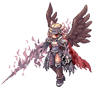

<h1 align="center">
    
     
</h1>

  
  

Ragnarok database built with React Native

## Motivation

Ragnarok was one of my first MMORPG, i played a lot when i was kid, my love for this game started on 2006 and played until 2011, and i still remember many things in this games, like monsters, maps, items. The golden age of this game i couldn't even imagine that i would be a programmer someday, and now i'm here,with this project for Ragnarok not be forgotten.

## Download

Go to the [releases page](https://github.com/scitbiz/flutter_pokedex/releases) to download the latest available apk.

## App preview

## :zap: Installation and Instructions

- Add [React Native](https://facebook.github.io/react-native/docs/getting-started) on your machine

- Install the packages `npm install`

## :clipboard: Todos

- [x] Home
- [x] Monster List
- [x] Monster List - Per Race
- [x] Monster Info - Status
- [x] Monster Info - Drops
- [x] Monster Info - Location
- [ ] Maps
- [ ] Monster by Map
- [ ] Items

## :art: Inspired on

- [Saepul Nahwan](https://dribbble.com/saepulnahwan23) for his [Pokedex App design](https://dribbble.com/shots/6545819-Pokedex-App)
- [ragnadb](https://ragnadb.com) - The best ragnarok database online

## :handshake: **Contributing**
If you liked the project and want to cooperate feel free to fork this repository and send Pull Requests.

All kinds of contributions are very welcome and appreciated

-   ⭐️ Star the project
-   🐛 Find and report issues
-   📥 Submit PRs to help solve issues or add features

## :book: License
MIT license, Copyright (c) 2019 Keven Leone.
